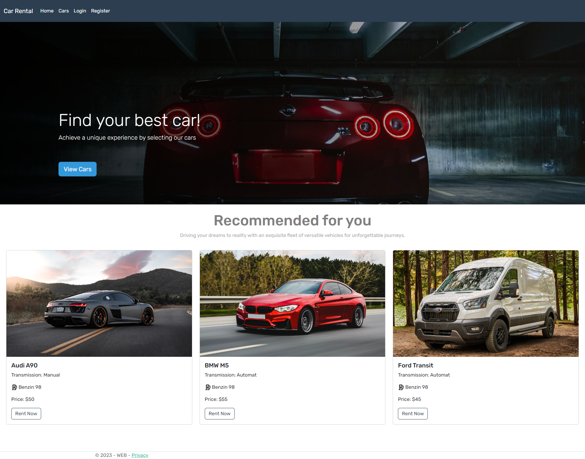
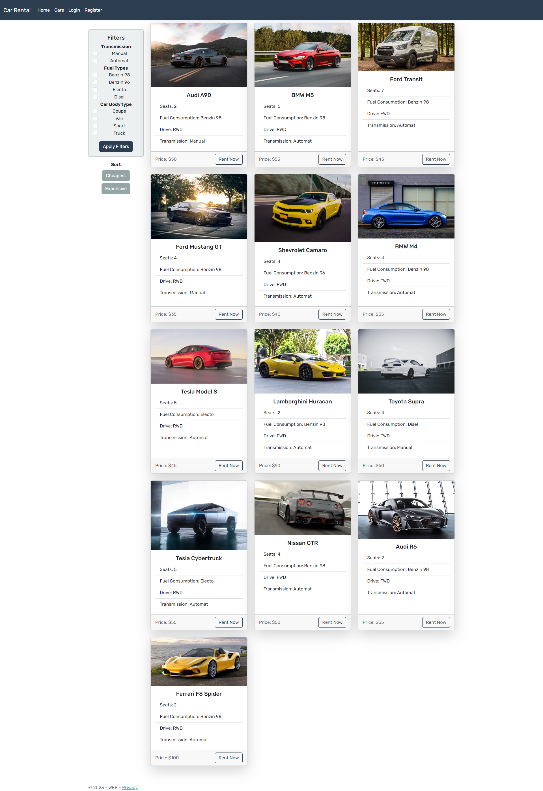
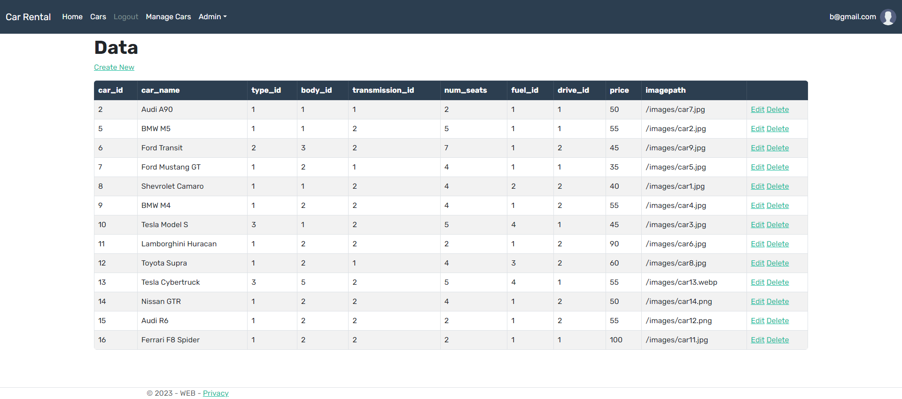
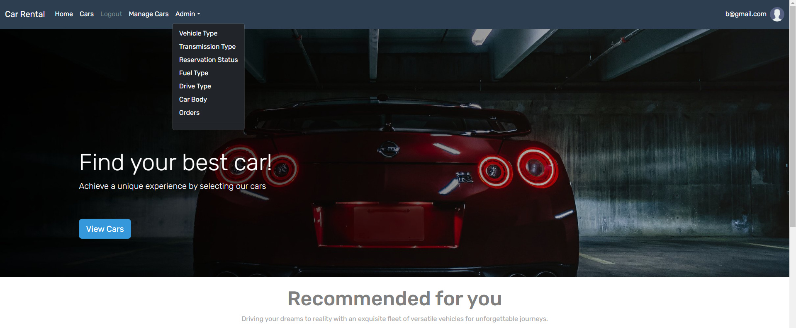

### Project Overview:
Project Name: **Car Rental**                    
Creation Date: **July 2023**

Technologies used in the project:
C# .NET, ASP.NET MVC,
Entity, Identity framework - for working with database,
Vertical slices - for grouping the project structure and methods,
Patterns - CQRS, MediatR

# Screenshots:

